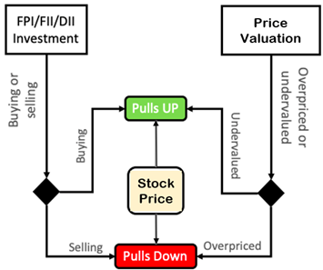

# MARKET_BEHAVIOUR_DURING_ISRO_LAUNCHES

## GOAL    
    
    Through this project we try to understand how stock markets behave due to historic events such as ISRO Launches.
    
    Best way to determine that is by using the data of the companies that have partnered in those launches.

    An API is Created from the download link from Yahooo finance website.

    Scraped the data using tickers of the companies involved. But before that

    Know how stock market functions .

    Performed data analysis using moving average method for closing prices .

    Calculated the returns of each company using simple moving averages method.

    Identified the most profitable company with best returns

    Used Exponential Moving Averages Method for (3-8-13)days.A method used by short term traders

    which tells when a stock is bullish or is going to dip.So they can buy/sell and make profits.

## HOW TO RUN :

Download the note book and replace the date and ticker data with any other company and you want. Modify and Run 

## CONCLUSION

    *In terms of growth percentage BHEL and MTARTECH and CENTUM had the highest among all**
  **In terms of value we can see that MTARTECH,TATAELXSI,CENTUM were the highest.**
